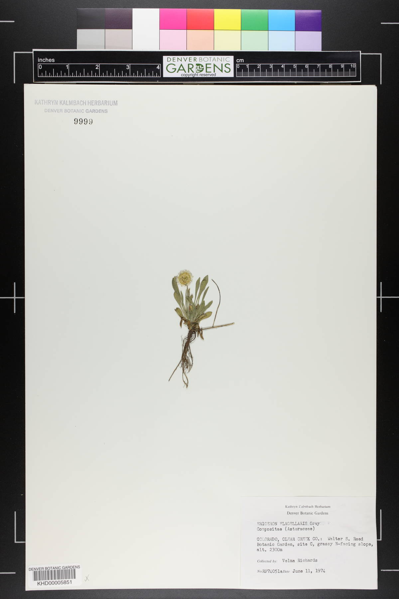

# preston-dbg-2022
preston archive with hashes of over 200k images associated with Denver Botanical Gardens.


This archive includes provenance logs. These provenance logs associate resource locations (URLs) to the signature (or hash) of their associated content. 

The associated content is too bulky to be stored in a GitHub repo, and is available at their original source location, or (temporarily) via https://linker.bio .

So, if you'd like to clone this repository including associated content, you can say:

```
preston verify --remote https://linker.bio
```

after cloning this repository using git, and changing directory into the root of that local repository.


If all goes well, the result of

```
preston verify 
```
should only include lines with "OK"

and 

```
preston head
```

should return 

hash://sha256/de7f05778f337d3fcf585aabeef620bc597a4d39b56937a1bd8f3cba3a9edf73

encoded in the associated qrcode

 

also, the last image reference, obtained via:

```
preston head | xargs -L1 preston cat | tail | grep hasVersion | tail -n1
```

should be:

```
<https://intermountainbiota.org/imglib/h_seinet/seinet/KHD/KHD00005/KHD00005851.JPG> <http://purl.org/pav/hasVersion> <hash://sha256/6a1c19a6e88090407a4a8535c642e1376beb16d9ef3e7141d3c091abcd769249> <urn:uuid:62a8ad95-e434-41b9-89c1-8ea3b53965c7> .
```

or associated image:




# references

Elliott et al. 2022 . List source URLs related to image hashes #196. <em>GitHub</em>. https://github.com/bio-guoda/preston/issues/196
 
Poelen et al. 2022. index images from Denver Botanical Garden #193. <em>GitHub</em>. https://github.com/bio-guoda/preston/issues/193

# metadata

``` 
preston cat --remote https://linker.bio 'zip:hash://sha256/ce28d5b19f0daf73efd27d8c734e7e74737bc7075ca893591af0664b41a405c7!/eml.xml' | xmllint -format -
```

produced ecological metadata language file associated with this collection

```xml
<?xml version="1.0" encoding="UTF-8"?>
<eml:eml xmlns:eml="eml://ecoinformatics.org/eml-2.1.1" xmlns:dc="http://purl.org/dc/terms/" xmlns:xsi="http://www.w3.org/2001/XMLSchema-instance" xsi:schemaLocation="eml://ecoinformatics.org/eml-2.1.1 http://rs.gbif.org/schema/eml-gbif-profile/1.0.1/eml.xsd" packageId="e7fc625b-da4e-492c-9870-c4973e8d8ae1" system="https://symbiota.org" scope="system" xml:lang="eng">
  <dataset>
    <alternateIdentifier>https://intermountainbiota.org/portal/collections/misc/collprofiles.php?collid=113</alternateIdentifier>
    <title xml:lang="eng">Kathryn Kalmbach Herbarium</title>
    <creator id="fcca2385-4ac1-44bb-bcd8-8e98336a2830">
      <organizationName>Consortium of Intermountain Herbaria</organizationName>
      <electronicMailAddress>seinetAdmin@asu.edu</electronicMailAddress>
      <onlineUrl>https://intermountainbiota.org/portal/index.php</onlineUrl>
    </creator>
    <metadataProvider>
      <organizationName>Consortium of Intermountain Herbaria</organizationName>
      <electronicMailAddress>seinetAdmin@asu.edu</electronicMailAddress>
      <onlineUrl>https://intermountainbiota.org/portal/index.php</onlineUrl>
    </metadataProvider>
    <pubDate>2022-09-02</pubDate>
    <language>eng</language>
    <abstract>
      <para>The Kathryn Kalmbach Herbarium (KHD), a collection of over 75,000 vascular plant specimens, is a regional herbarium with a research focus on the species diversity of Colorado and the Southern Rocky Mountain region. The collection also contains species that are in cultivation at Denver Botanic Gardens. Most of the specimens within the collection have been digitized, and their photographs may be found online. Higher resolution images are also available upon request. Specimens collected in 2017 and later are likely to have an associated tissue sample available on GGBN.</para>
    </abstract>
    <contact>
      <organizationName>Kathryn Kalmbach Herbarium</organizationName>
      <phone>7208653657</phone>
      <electronicMailAddress>richard.levy@botanicgardens.org</electronicMailAddress>
      <userId>https://orcid.org/0000-0002-4401-1380</userId>
      <onlineUrl>http://www.botanicgardens.org/science-research/our-collections</onlineUrl>
      <addr>
        <deliveryPoint>1005 York Street</deliveryPoint>
        <city>Denver</city>
        <administrativeArea>CO</administrativeArea>
        <postalCode>80206</postalCode>
        <country>USA</country>
      </addr>
    </contact>
    <associatedParty>
      <individualName>
        <surName>Levy</surName>
        <givenName>Rick</givenName>
      </individualName>
      <electronicMailAddress>richard.levy@botanicgardens.org</electronicMailAddress>
      <positionName>Scientific Data Manager</positionName>
      <userId>https://orcid.org/0000-0002-4401-1380</userId>
      <role>contentProvider</role>
    </associatedParty>
    <intellectualRights>
      <para>To the extent possible under law, the publisher has waived all rights to these data and has dedicated them to the <ulink url="http://creativecommons.org/publicdomain/zero/1.0/"><citetitle/></ulink></para>
    </intellectualRights>
  </dataset>
  <additionalMetadata>
    <metadata>
      <symbiota id="fcca2385-4ac1-44bb-bcd8-8e98336a2830">
        <dateStamp>2022-09-02T08:58:46-07:00</dateStamp>
        <citation identifier="a4608bea-5a37-4a3c-929d-6517cc52be05">Consortium of Intermountain Herbaria - a4608bea-5a37-4a3c-929d-6517cc52be05</citation>
        <physical>
          <characterEncoding>UTF-8</characterEncoding>
          <dataFormat>
            <externallyDefinedFormat>
              <formatName>Darwin Core Archive</formatName>
            </externallyDefinedFormat>
          </dataFormat>
        </physical>
        <collection identifier="ca77be98-2a59-4aa9-bfc1-5ea615f2e6b7" id="113">
          <alternateIdentifier>https://intermountainbiota.org/portal/collections/misc/collprofiles.php?collid=113</alternateIdentifier>
          <parentCollectionIdentifier>DBG</parentCollectionIdentifier>
          <collectionIdentifier>KHD</collectionIdentifier>
          <collectionName>Kathryn Kalmbach Herbarium</collectionName>
          <resourceLogoUrl>https://swbiodiversity.org/seinet/content/collicon/dbg.jpg</resourceLogoUrl>
          <onlineUrl>http://www.botanicgardens.org/science-research/our-collections</onlineUrl>
          <intellectualRights>http://creativecommons.org/publicdomain/zero/1.0/</intellectualRights>
          <additionalInfo>Public Domain</additionalInfo>
          <associatedParty>
            <individualName>
              <surName>Levy</surName>
              <givenName>Rick</givenName>
            </individualName>
            <electronicMailAddress>richard.levy@botanicgardens.org</electronicMailAddress>
            <positionName>Scientific Data Manager</positionName>
            <userId>https://orcid.org/0000-0002-4401-1380</userId>
          </associatedParty>
          <abstract>
            <para>&lt;p&gt;The Kathryn Kalmbach Herbarium (KHD), a collection of over 75,000 vascular plant specimens, is a regional herbarium with a research focus on the species diversity of Colorado and the Southern Rocky Mountain region. The collection also contains species that are in cultivation at Denver Botanic Gardens. Most of the specimens within the collection have been digitized, and their photographs may be found online. Higher resolution images are also available upon request. Specimens collected in 2017 and later are likely to have an associated tissue sample available on GGBN.&lt;/p&gt;</para>
          </abstract>
        </collection>
      </symbiota>
    </metadata>
  </additionalMetadata>
</eml:eml>
```
